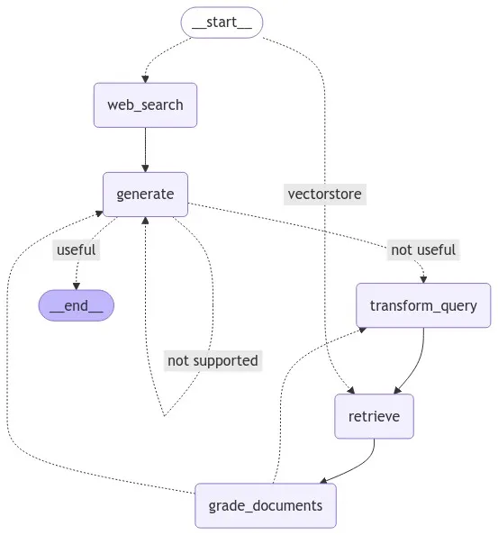

# Advanced Adaptive RAG Pipeline

A production-grade, self-correcting Retrieval-Augmented Generation (RAG) system built with LangGraph, Google Gemini, and ChromaDB. This agent evaluates its own retrieval quality, rewrites queries when necessary, and checks for hallucinations before generating a final response.

## Architecture



The pipeline utilizes a cyclic state graph with the following core components:
* **Router:** Directs queries to local vector storage or fallback web search.
* **Retriever & Grader:** Fetches document chunks and strictly filters out irrelevant context.
* **Rewriter:** Reformulates user prompts if the retrieved context is insufficient.
* **Generator & Validator:** Synthesizes answers and performs hallucination checks against the source documents.

## Prerequisites

* Python 3.9+
* Google Gemini API Key

## Installation

1. Clone the repository and navigate to the project directory.
2. Install the required dependencies:

```bash
pip install langgraph langchain-core langchain-google-genai langchain-community chromadb pymupdf pydantic streamlit
```


### Set your environment variable for authentication:

Mac/Linux:

```
export GOOGLE_API_KEY="your_api_key_here"
Windows:

DOS
set GOOGLE_API_KEY="your_api_key_here"
```
### Usage
## 1. Ingest Documents
Before running the agent, load your PDF documents into the local Chroma vector database. Place your target PDF in the root directory and run:

```
python pdf_processor.py
``` 
## 2. Run the Web Interface
Launch the Streamlit frontend to interact with the agent:

```
streamlit run app.py
```
